## Vspy Windows Based Keylogger v1.0 🕵️‍♂️

### Overview 🎯

Welcome to Vspy, a demonstration keylogger built for educational purposes. This tool showcases keylogging functionalities and is intended solely for ethical and educational use. Please read this README file carefully before deploying the application.

### GitHub Repository 🌐

Visit our GitHub repository for the latest updates and source code: [Vspy GitHub](https://github.com/Rathod-Rahul/Vspy-Deployment.git)

### Prerequisites 🛠️

- Node.js installed
- XAMPP or a local server for the database

### Installation 🚀

1. Clone the repository:
   ```bash
   git clone https://github.com/Rathod-Rahul/Vspy-Deployment.git
2. ```bash
   cd Vspy-Deployment
3. ```bash
   npm install
4. Configure the database:
 Create a .env file in the project root and add the following variables:
- **DB_HOST:** localhost
- **DB_USER:** root
- **DB_PORT:** 3306
- **DB_PASSWORD:** ""
- **DB_DATABASE:** [Your Database Name]
- **SESSION_SECRET:** [Your Secret]
- **SESSION_NAME:** [Your Session Name]
- **SESSION_LIFETIME:** [Session Lifetime in milliseconds]
- **EMAIL_ADDRESS:** [Your Email Address]
- **EMAIL_PASSWORD:** [Your Email Password]
- 
Note: If using XAMPP, the default root user with an empty password and port 3306 is assumed. Ensure you create the main_log database and a user table with columns: id, username, password, email, and reset_token.


5. Start the application:
6. ```bash
     npm start
7. Open your web browser and visit http://localhost:3000 to access the Vspy dashboard.

## Features of Vspy Keylogger 🌟

### 1. Password Harvesting Module 🔐

- Easily retrieve and manage stored passwords from Google Chrome, making it simpler to access and organize login credentials.

### 2. Cookie Surveillance Engine 🍪

- Safeguard your online accounts by capturing and securely logging Chrome cookies, ensuring a secure and hassle-free online experience.

### 3. Real-time Keystroke Logger ⌨️

- Monitor and record keystrokes in real-time, providing insights into user behavior without compromising data privacy.

### 4. Clipboard Data Interceptor 📋

- Retrieve clipboard content in real-time, streamlining workflows and enabling quick access to copied information.

### 5. Location Intelligence Module 🌐

- Facilitate targeted actions and monitor movements responsibly with location information features.

### 6. Browser History Scraper 🕵️‍♀️

- Easily review and analyze your entire browsing history, gaining insights into online activities and preferences.

### 7. Application Tracking System 📊

- Understand your software usage patterns by identifying and logging all running applications on your computer.


## Vspy Node.js Backend Dashboard Quick Guide 🚀


### Step 1: Create Account in Vspy Dashboard 📝

- Visit the Vspy dashboard and click on the "Sign Up" button.
- Fill in the required information to create your account.
  
  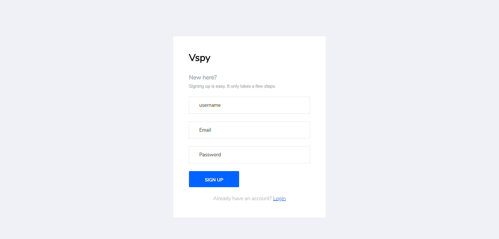

### Step 2: Login to Vspy Dashboard 🔑

- Use your credentials to log in to the Vspy dashboard.
  
  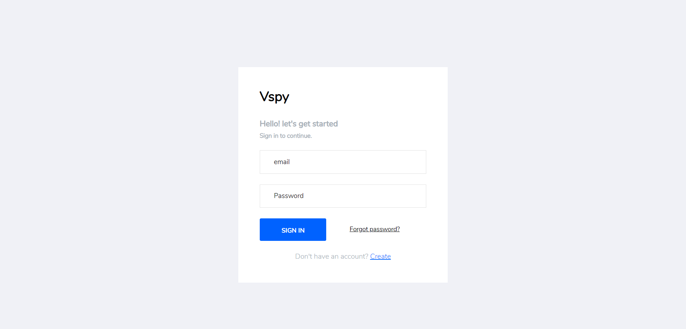

### Step 3: View All Data on Dashboard 📊

- After logging in, explore the dashboard to view various features and collected data.
  
  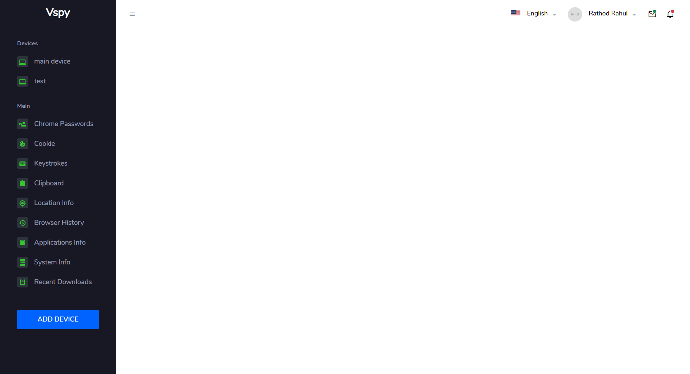

### Step 4: Add Device for Python Keylogger Code 🖥️

- Navigate to the "Devices" section.
- Click on "Add Device" and follow the instructions to add a new device.
  
  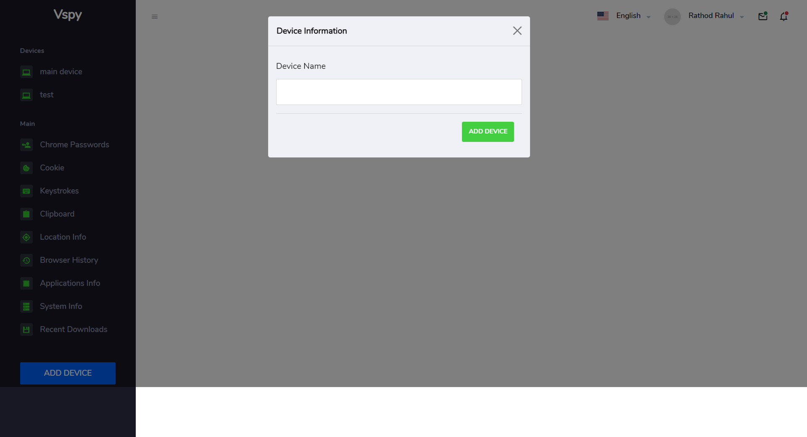

### Step 5: Download Python Keylogger Code 🐍

- From the dashboard, click on the device name.
- A model will open, providing a download link for the Python keylogger code.
  
  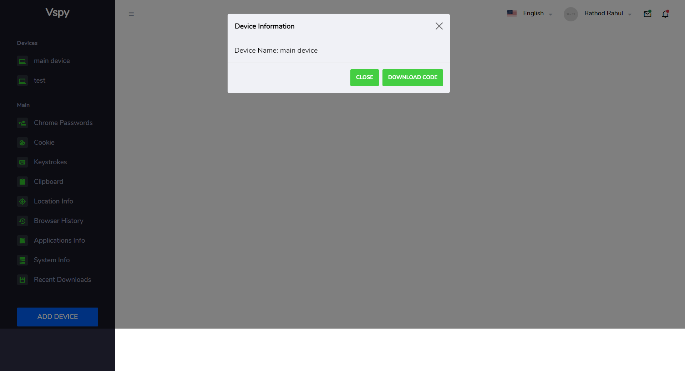

### Step 6: Modify Python Code for Database Configuration 🛠️

- Open the downloaded Python keylogger code.
- Configure the database settings in the Python code to match the ones in the `.env` file.
- Add a note emphasizing that both database configurations must be the same.
  


### Step 7: Install Python on Demo PC/Laptop and Run Keylogger Script 🚀

- Install Python on the demo PC or laptop.
- Run the modified Python keylogger script to extract information.
  


### Step 8: View Collected Information on Dashboard 📈

- Return to the Vspy dashboard to view the collected information from the demo PC or laptop.
- Explore different sections to see passwords, keystrokes, clipboard content, etc.
  

#### 1. Chrome Passwords

- View and manage stored passwords from the Google Chrome browser.

  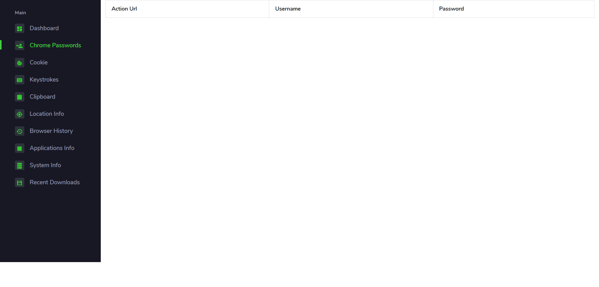

#### 2. Cookie Surveillance

- Safeguard your online accounts by monitoring and logging Chrome cookies.

  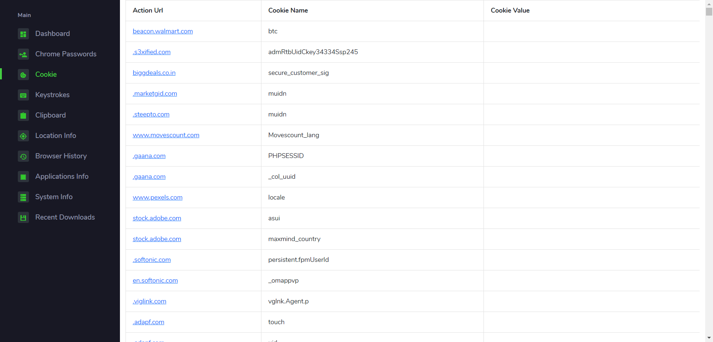

#### 3. Keystrokes

- Monitor and record real-time keystrokes, providing insights into user behavior.

  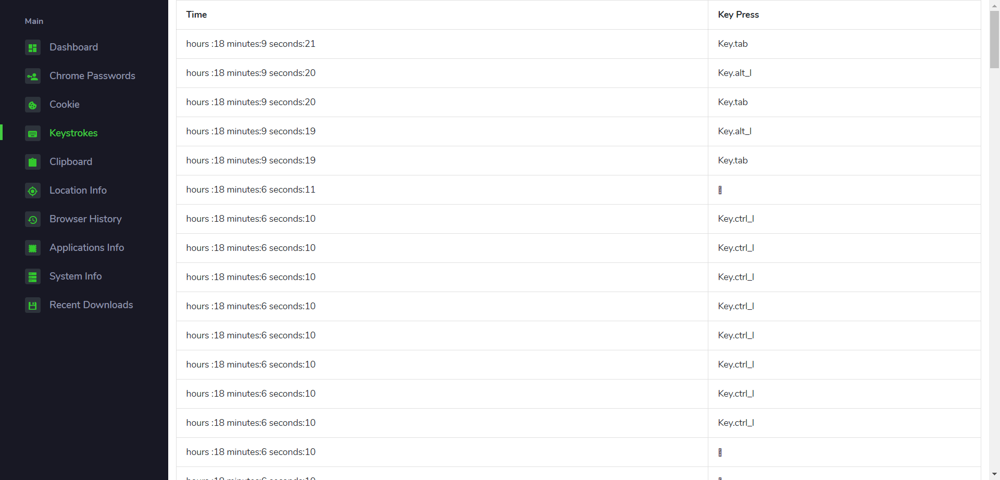

#### 4. Clipboard

- Retrieve clipboard content in real-time, streamlining workflows.

  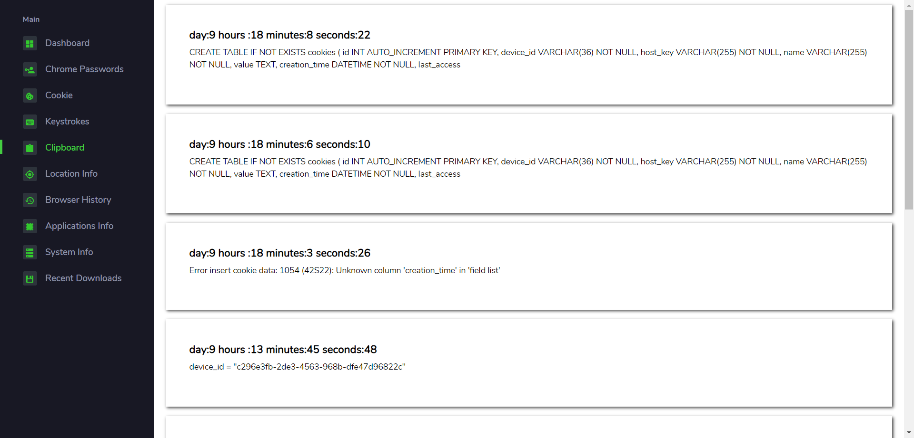

#### 5. Location Information

- Gather and report the user's location information.

  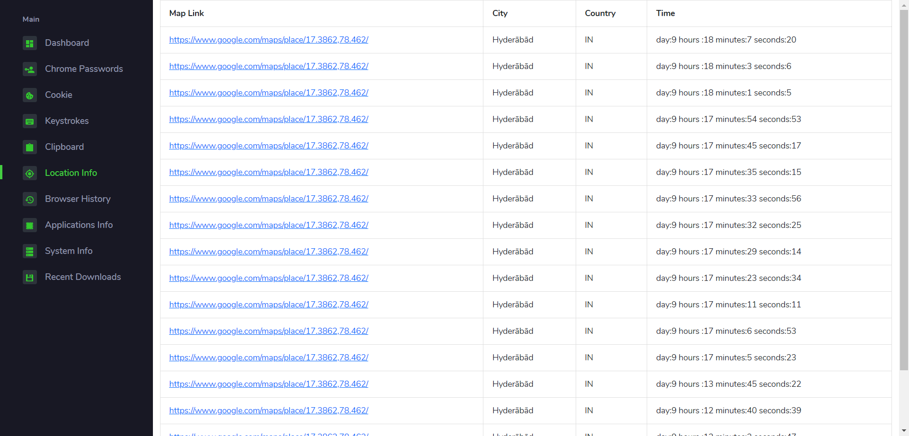

#### 6. Browser History

- Log the user's entire browsing history for insights into online activities.

  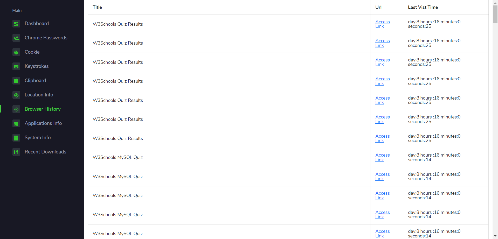

#### 7. Applications Information

- Identify and log all running applications on the user's computer.

  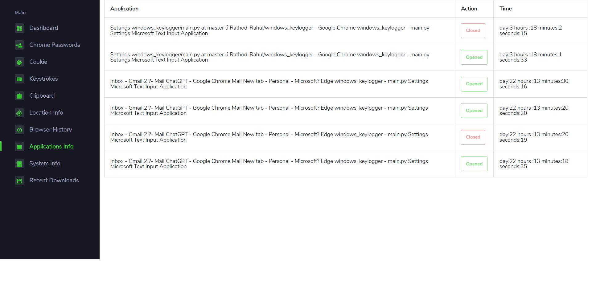

#### 8. System Information

- Access information about the user's system for a comprehensive overview.

  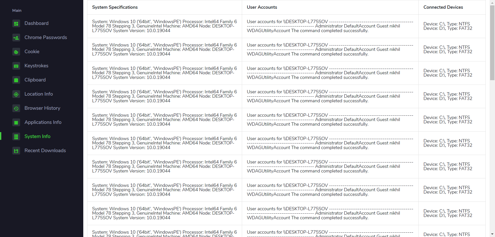

#### 9. Recent Downloads

- Provide detailed information on recent downloads.

  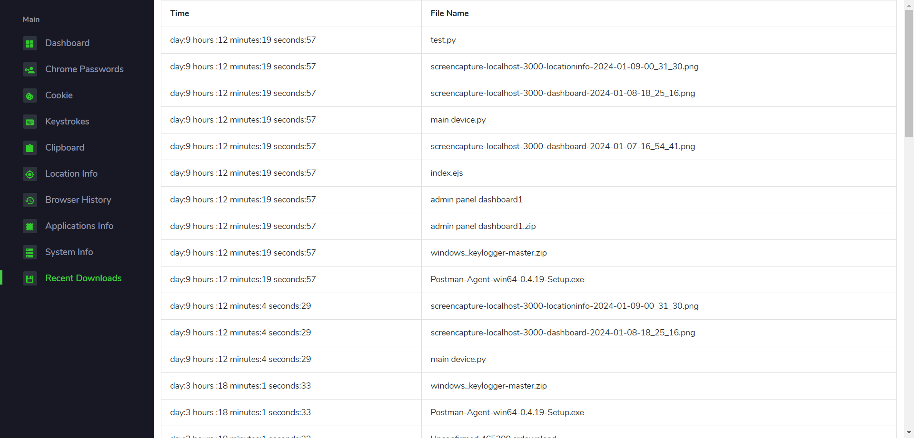


### 8. Download Surveillance Module 📥

- Track recent downloads, empowering you to manage acquired files and stay vigilant against potential security threats.


# Disclaimer ⚠️

This tool is for educational purposes only. Ensure compliance with local laws and ethical standards. The creator assumes no responsibility for any misuse or unauthorized access.
